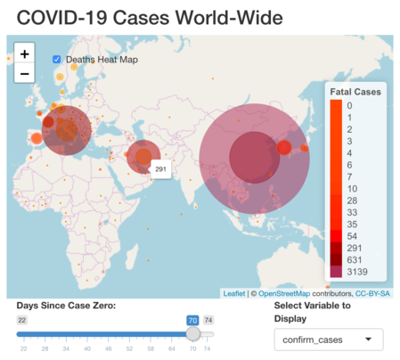
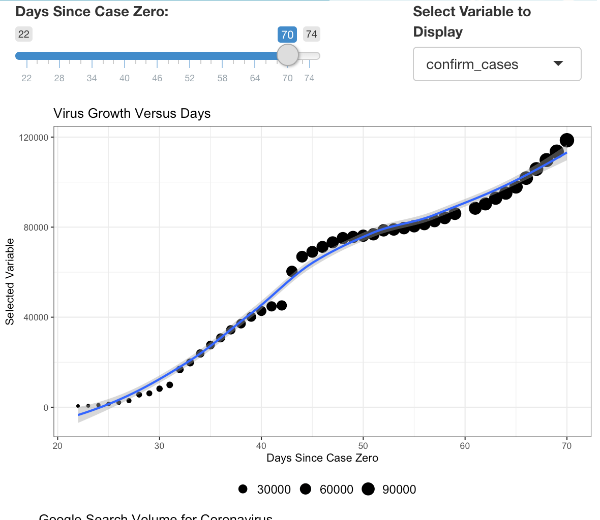

```{r setup, include=FALSE}
knitr::opts_chunk$set(echo = FALSE, message=FALSE, warning=FALSE, fig.height = 4, fig.width = 6 )
```


```{r}
#Import required libraries
library(tidyverse) 
library(tidytext)
library(ggplot2)
library(rtweet)
library(gtrendsR)
library(plyr)
library(magrittr)
library(rvest)
library(shiny)
library(leaflet)
library(dplyr)
library(leaflet.extras)
```

```{r}
#Import local Datasets
country_confirm <- read.csv('data/time_series_covid_19_confirmed.csv')
country_deaths <- read.csv('data/time_series_covid_19_deaths.csv')
country_recovered <- read.csv('data/time_series_covid_19_recovered.csv')
```

```{r}
#Import data from Google API
keywords=c("Coronavirus","facebook","wuhan") #define the keywords
time=("2020-01-01 2020-03-17") #set the time window
channel='web' #set channel 
trends = gtrends(keywords, gprop =channel, time = time) #Get trends from Google API 
trends <- rbind.fill(trends) #Create CSV format dataset from data object

#Clean google trends dataset
trends <- trends %>% filter(!is.na(hits))
trends$hits <- as.numeric(as.character(trends$hits))
trends <- trends %>% filter((trends$hits > 0.0) & !is.na(trends$time))
```


```{r}
#Get latitude and longitude of all countries. Remove all duplicates
country_lat_long <- country_confirm%>%select(2,3,4)
country_lat_long<- country_lat_long[!duplicated(country_lat_long$Country.Region),]

#Sum all provincial values to a country and remove Duplicates for all countries
country_confirm<-country_confirm%>%select(2,5:57)
country_confirm<-country_confirm%>%group_by(Country.Region)%>%summarise_all(funs(sum))
country_deaths<-country_deaths%>%select(2,5:57)
country_deaths<-country_deaths%>%group_by(Country.Region)%>%summarise_all(funs(sum))
country_recovered<-country_recovered%>%select(2,5:57)
country_recovered<-country_recovered%>%group_by(Country.Region)%>%summarise_all(funs(sum))
```


```{r}
country_confirm_dates <- country_confirm
country_confirm_dates <- country_confirm_dates%>%pivot_longer(-Country.Region, names_to = 'Date', values_to = 'confirm_cases')
country_confirm_dates$Date <-  gsub("[a-zA-Z ]", "", country_confirm_dates$Date)
country_confirm_dates$month <- substr(country_confirm_dates$Date,0,1)
country_confirm_dates$day <- substr(country_confirm_dates$Date,3,4)
country_confirm_dates$day <-  gsub("\\.", "", country_confirm_dates$day)
country_confirm_dates$month <- as.numeric(as.character(country_confirm_dates$month))
country_confirm_dates$day <- as.numeric(as.character(country_confirm_dates$day))
country_confirm_dates$days <- ((country_confirm_dates$month*30)+(country_confirm_dates$day)-30)
country_confirm_dates <- country_confirm_dates%>%select(1,3,6)
country_confirm_dates$ID <- paste(country_confirm_dates$Country.Region, as.character(country_confirm_dates$days),"")
country_confirm_dates<- country_confirm_dates[!duplicated(country_confirm_dates$ID),]
```

```{r}
country_death_dates <- country_deaths
country_death_dates <- country_death_dates%>%pivot_longer(-Country.Region, names_to = 'Date', values_to = 'death_cases')
country_death_dates$Date <-  gsub("[a-zA-Z ]", "", country_death_dates$Date)
country_death_dates$month <- substr(country_death_dates$Date,0,1)
country_death_dates$day <- substr(country_death_dates$Date,3,4)
country_death_dates$day <-  gsub("\\.", "", country_death_dates$day)
country_death_dates$month <- as.numeric(as.character(country_death_dates$month))
country_death_dates$day <- as.numeric(as.character(country_death_dates$day))
country_death_dates$days <- ((country_death_dates$month*30)+(country_death_dates$day)-30)
country_death_dates <- country_death_dates%>%select(1,3,6)
country_death_dates$ID <- paste(country_death_dates$Country.Region, as.character(country_death_dates$days),"")
country_death_dates<- country_death_dates[!duplicated(country_death_dates$ID),]
```

```{r}
country_recovered_dates <- country_recovered
country_recovered_dates <- country_recovered_dates%>%pivot_longer(-Country.Region, names_to = 'Date', values_to = 'recovered_cases')
country_recovered_dates$Date <-  gsub("[a-zA-Z ]", "", country_recovered_dates$Date)
country_recovered_dates$month <- substr(country_recovered_dates$Date,0,1)
country_recovered_dates$day <- substr(country_recovered_dates$Date,3,4)
country_recovered_dates$day <-  gsub("\\.", "", country_recovered_dates$day)
country_recovered_dates$month <- as.numeric(as.character(country_recovered_dates$month))
country_recovered_dates$day <- as.numeric(as.character(country_recovered_dates$day))
country_recovered_dates$days <- ((country_recovered_dates$month*30)+(country_recovered_dates$day)-30)
country_recovered_dates <- country_recovered_dates%>%select(1,3,6)
country_recovered_dates$ID <- paste(country_recovered_dates$Country.Region, as.character(country_recovered_dates$days),"")
country_recovered_dates<- country_recovered_dates[!duplicated(country_recovered_dates$ID),]
```

```{r}
country_final<-left_join(x=country_confirm_dates,y=country_recovered_dates, by="ID")
country_final<- country_final%>%select(1:4,6)
country_final <- country_final %>% distinct()
country_final<-left_join(x=country_final,y=country_death_dates, by="ID")
country_final<- country_final%>%select(1:5,7)
country_final <- country_final %>% distinct()
```


```{r}
data<-left_join(x=country_final,y=country_lat_long,by=c("Country.Region.x"="Country.Region"))
data2<-data%>%select(2,3,5,6)
data2<-data2%>%group_by(days.x)%>%summarise_all(funs(sum))
```


```{r}
ui <- fluidPage(
  mainPanel( 
    titlePanel("COVID-19 Cases World-Wide"),
    fluidRow(
      leafletOutput(outputId = "mymap",width = "100%", height = 400),
          absolutePanel(top = 80, left = 70, 
          checkboxInput("deaths", "Deaths Heat Map", FALSE)
        ),
    ),
    fluidRow(
      
     column(8,
               sliderInput("day_number",
                           "Days Since Case Zero:",
                           min = 22,
                           max = 74,
                           value = 70)
        ),
     column(4,
           varSelectInput("variable", 
                        "Select Variable to Display", 
                      data = data2 %>% select(confirm_cases, recovered_cases, death_cases))
  )
     
    ),
    fluidRow(
      plotOutput("plot2")
    ),
  fluidRow(
      plotOutput("plot")
    )
))
```

```{r}
server <- function(input, output, session) {
  
 pal <- colorNumeric(
    palette = c( 'orange', 'orange red','dark red'),
    domain = data$confirm_cases)
  
 pal2 <- colorFactor(
    palette = c('orange red','red', 'dark red', 'maroon'),
    domain = data$death_cases
  )
  
#create the map
  output$mymap <- renderLeaflet({
    mapday <-input$day_number  
    leaflet(data) %>% 
      setView(lng = 41, lat = 12, zoom = 2.1)  %>% 
      addTiles() %>% 
      addCircles(data = data%>%filter(data$days.x == mapday),
                 lat = ~ Lat,
                 lng = ~ Long,
                 weight = 1,
                 radius = ~sqrt(confirm_cases)*4500,
                 popup = ~as.character(confirm_cases),
                 label = ~as.character(confirm_cases),
                 color = ~pal(confirm_cases),
                 fillOpacity = 0.5
                 )
  })
  

  observe({
    mapday <-input$day_number
    deathData <- data%>%filter(data$days.x == mapday)
    proxy <- leafletProxy("mymap",data = deathData)
    proxy %>% clearMarkers()
    if (input$deaths) {
      
      proxy %>% addCircleMarkers(data = deathData,
                                 stroke = FALSE,
                                 color = ~pal2(deathData$death_cases),
                                 fillOpacity = 0.5,
                                 radius = ~sqrt(deathData$death_cases)*1.5,
                                 label = ~as.character(deathData$death_cases)
                                 ) %>%
                                  addLegend("bottomright",
                                            pal = pal2,
                                            values = deathData$death_cases,
                                            title = "Fatal Cases",
                                            opacity = 100
                                  )
      }
    else {
      proxy %>% clearMarkers() %>% clearControls()
    }
  })
  
  #!!input$variable
  output$plot2 <- renderPlot({
    numday <- input$day_number
    ggplot(data = data2 %>% filter(data2$days.x <= numday)) + 
          geom_point(aes(x = days.x,
                         y=!!input$variable, size=!!input$variable)) +
          geom_smooth(aes(x = days.x,
                          y=!!input$variable)) +
          ggtitle("Virus Growth Versus Days Since Patient Zero") +
          xlab("Days Since Case Zero") +
          ylab("Selected Variable")+
          theme_bw()+
          theme(legend.title =     element_blank(),
                legend.position="bottom",
                legend.text=element_text(size=12)
          )
  })
  
  
  
  
  
  output$plot <- renderPlot({
    numday <- input$day_number
    ggplot(data=trends,
           aes(x=date,
               y=hits,
               group=keyword,
               col=keyword))+
              geom_line()+
              xlab('Time')+
              ylab('Relative Interest')+
              theme_bw()+
              theme(legend.title =    element_blank(),
                    legend.position="bottom",
                    legend.text=element_text(size=12))+
              ggtitle("Google Search Volume for Coronavirus")
  })
  
  
  
}
```

```{r}
shinyApp(ui, server)
```


{width=500px}
{width=500px}

## Shiny App Discussion


The project included a scatter plot with one of the y-axis variables as confirmed cases of COVID-19 virus around the world. The graph above(presented in the screenshot) shows us a relatively linear increase in the number of the case since from day 22 onwards, however, it can be seen that there is a sudden increase in the number of cases around day 43. This sudden jump in numbers can be tracked down to refinement of diagnostic criteria by Chinese scientists on 12th February earlier this year. This sudden uptick was reported in several news media channels including The New York Times*. Since most early cases of COVID-19 virus were present in the Chinese Province of Hubei we can also see that after policy changes were made to lock down the province there was a decrease in the growth rates that can be visible in the days following 13th February (Day 44). 

The decrease in the curve's gradient, however, does not last long as we can see a positive quadratic rate of change in the number of confirmed cases. The increase in the curves' gradient can be related to a sharp increase in the number of cases in Iran and European countries such as Italy, Germany, and France. We can infer from the results of the Chinese government's policy change regarding the lockdown that it can play a significant role in decreasing new cases of the COVID-19 virus thus reducing the chances of an exponential increase in the spread of coronavirus. 

In figure three I use google search trends to analyze the popularity of coronavirus searches versus google searches for the world's biggest social media platform, "Facebook". We can see from the graph that before late February Coronavirus searches were half as popular as those for Facebook but following a sudden increase in the growth rates for the virus and the spread of the virus to countries worldwide, there was a sharp increase in searches related to coronavirus. In the course of a month, google searches for coronavirus exceed those for Facebook by almost four to one. This increase in searches is a sign of mass concern/fear around the world.

Figure 1. shows an interactive world map with translucent circles showing the number of Coronavirus cases in each country. We can see from the graph that the cases of COVID-19 contraction in the European Union are spread from country to country. One of the many reasons for this form of spreading of the virus can be related to the ease of travel due to treaties in the E.U. If we are to use the slider from day 55 onwards, the trend can be seen as the virus takes a strong-hold in southern Europe traveling to neighboring countries.


* https://www.nytimes.com/2020/02/12/health/coronavirus-cases-china.html


## Technical Report 


To build this shiny app I used extensive data-wrangling and manipulation to restructure my data to be used efficiently in the app. The initial datasets were using every date as a column, and each kind of case (confirmed, recovered, death) as it's CSV format file. To structure this data according to the needs of the project, I use the 'select' command to create subsets of the datasets. Since my several countries were also reported with provinces/states I collected and summed up results for these countries using the 'group_by' and 'summarize' commands. Since the dates for all subsets were noted in a non-conventional method, I created substrings from the dates and then changed the dates into days since the first reported day for the data which made it easier to create the slider later in the project. Once all datasets were in the right formats I used the 'left_join' command by creating unique IDs for each column; to then combine my datasets into a singular uniform dataset which I used to create an interactive world map.

To create an interactive world map within my shiny app, I used several of the techniques we learned throughout class followed by personal research. I used the leaflet API/library to create the world. To plot the initial points of reported COVID-19 cases I used the renderLeaflet method which creates an instance of the leaflet class. Within this map, I used the 'and circles' function to then plot the cases by country using the longitude/latitude information from my dataset. To showcases by severity, I set the colors and sizes of the points on the table to change by the number of cases in a country. I then use the 'Observe' method to track any clicks on the checkbox to show the heatmap for several deaths in a country which are also represented by circles overlaying on the map with aesthetic differences according to the severity. I used the knowledge of sliders and scatterplots learned during the period of the class to make the map/plot responsive to the users' input.

Finally, I used the knowledge of web scraping and additional research to scrape google search trends data through the Google trends API which was returned in the form of a JSON object. I then converted the JSON object into a CSV format followed by filtering down the dataset to rows that matched the criteria. One of the harder challenges I faced during this project was to use Twitter's official developer API to scrape tweets about COVID-19 to study the trends in social media posts about the pandemic. However, I was unable to use the data provided through Twitter due to the technical limitation which limited mining to only 18000 tweets at a time which was not helpful in this case since on average there were almost 18000 tweets about the virus every thirty minutes. The code for twitter data mining API is attached in a separate file in the project directory.

In summary, I used the graph visualization, shiny apps, data wrangling, and data ethics skills that I learned during this course to create this shiny app successfully. 

